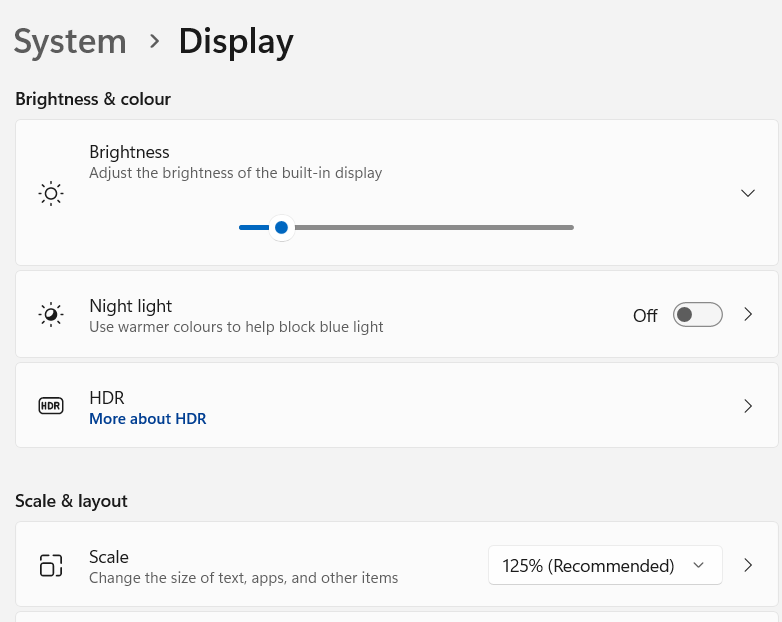

<!-- README.md is generated from README.Rmd. Please edit that file -->

# screenshot

<!-- badges: start -->
<!-- badges: end -->

The goal of screenshot is to take a screenshot easily and locate image
position on a display with R.

## Installation

You can install the development version from
[GitHub](https://github.com/) with:

``` r
# install.packages("devtools")
remotes::install_github("matutosi/screenshot")
```

On Win OS, need to install screenshot.exe by `install_screenshot()`.
This exe file is compiled from codes shown below.

<https://superuser.com/questions/75614/take-a-screen-shot-from-command-line-in-windows#answer-1751844>

``` r
library(screenshot)
install_screenshot()
  # if you want to install another directory
  # bin_dir <- "SET_YOUR DIRECTORY"
  # install_screenshot(bin_dir)
```

On Mac `screencapture` is usually available.

On Linux GNOME desktop use `gnome-screenshot`. If not installed, run
`sudo apt install gnome-screenshot`.

<!-- 
You can also install from CRAN:

```r
install.packages("screenshot")
```
-->

## Example

You can use `screenshot()` to take a screenshot easily.

``` r
library(screenshot)
sc <- screenshot()
sc_image <- imager::load.image(sc)
plot(sc_image)
```

To locate image from a screenshot, use `locate_image()`. In this case,
bottom left corner of screenshot image was cut off as needle image.

``` r
sc <- screenshot()
sc_image <- imager::load.image(sc)
w <- 100
h <- 80
pos_x <- 1
pos_y <- imager::height(sc_image) - h
needle <- hay2needle(sc_image, pos_x, pos_y, w, h)
(locate_image(needle)) # center location
pos <- locate_image(needle, center = FALSE)
found <- hay2needle(sc_image, pos[1], pos[2], w, h)
layout(c(1:3))
plot(sc_image)
plot(needle)
plot(found)
```

## Caution (=0.9.0)

- Automatically adjusted in 0.9.1 and latter.

When changing display DPI scaling, need to adjust position.

``` r
  # when using 125%
pos <- locate_image(IMAGE_TO_CLICK) / 1.25
KeyboardSimulator::mouse.move(pos[1], pos[2])
KeyboardSimulator::mouse.click()
```

You can see display scale in setting app as shown below.



## Citation

Toshikazu Matsumura (2023) screenshot. Screenshot and locate image
Easily. <https://github.com/matutosi/screenshot/>.
